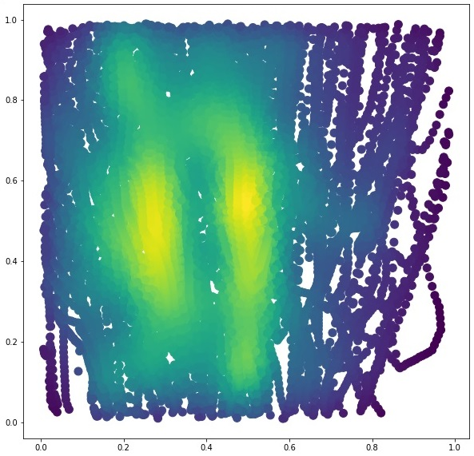
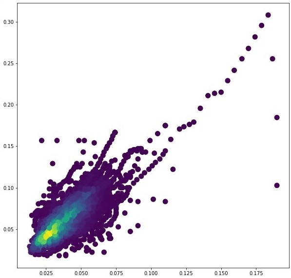

# TensorFlow-Help-Protect-the-Great-Barrier-Reef

[Colab Notebook](https://colab.research.google.com/drive/1qxT3vrJj_jDrqH5duvyFbhEZys5z9U7U?usp=sharing)

## Introduction
In this repository I introduce a solution for the kaggle competition [TensorFlow - Help Protect the Great Barrier Reef](https://www.kaggle.com/c/tensorflow-great-barrier-reef).  
The goal of this competition is to accurately identify starfish in real-time by building an object detection
model trained on underwater videos of coral reefs.  
In this competition, I will predict the presence and position of crown-of-thorns starfish in sequences of
underwater images taken at various times and locations around the Great Barrier Reef. Predictions take
the form of a bounding box together with a confidence score for each identified starfish. An image may
contain zero or more starfish.  
This competition uses a hidden test set that will be served by an API to ensure that the images are
evaluated in the same order they were recorded within each video. When the submitted notebook is
scored, the actual test data (including a sample submission) will be availabe to the notebook.

## Dataset
  
This dataset contains around 23.5k training images (4.9k only containing objects) and 13k test images.  
All of the images have a size of 1280x720.  
**Files**  
train/ - Folder containing training set photos of the form video_{video_id}/{video_frame_number}.jpg.  
[train/test].csv - Metadata for the images. As with other test files, most of the test metadata data is only available to your notebook upon submission. Just the first few rows available for download.  
* video_id - ID number of the video the image was part of. The video ids are not meaningfully ordered.  
* video_frame - The frame number of the image within the video. Expect to see occasional gaps in the frame number from when the diver surfaced.  
* sequence - ID of a gap-free subset of a given video. The sequence ids are not meaningfully ordered.  
* sequence_frame - The frame number within a given sequence.  
* image_id - ID code for the image, in the format '{video_id}-{video_frame}'  
annotations - The bounding boxes of any starfish detections in a string format that can be evaluated directly with Python. Does not use the same format as the predictions you will submit. Not available in test.csv. A bounding box is described by the pixel coordinate (x_min, y_min) of its upper left corner within the image together with its width and height in pixels.  

### Bounding Boxes Analysis

#### `x_center` Vs `y_center`

#### `width` Vs `height`

#### `Area`

## Approach
### Data Handling
1) For this competition the first step is to filter the images containing annotations and remove the ones with no annotations.
2) The image size that will be used for training will be **960x960** because the objects in the images are small, so we need a high resolution to detect the objects.

### Modeling
There are 4 approaches that I tried to achieve a high F2 score:  
1) Using a pretrained YOLOv5 model.
2) Using a pretrained YOLOX model.
3) Using a pretrained Swin Transformer model.
4) Ensemble solution by using both YOLOv5 and YOLOX.

### Training
The three models are finetuned on the dataset for 20 epochs.  
**The hyperparameters used were the default ones recommened for finetuning by the repository publishers.**

### Ensembling Approach
**Weighted boxes fusion (WBF) Algorithm:  **
A Method for combining predictions of object detection models, this algorithm utilizes confidence scores of all proposed bounding boxes to construct averaged boxes.

### Evaluation
F2 score is evaluated at every confidence level on validation dataset, so we can obtain the maximum f2 score value of each model.

## Results

#### F2 Score

        Approach                     Max F2 Score
       
        YOLOv5                          0.658
        YOLOX                           0.678
        Swin Transformer                0.608
        YOLOv5 + YOLOX                  0.692

## Conclusion
1) As expected YOLOX performs better than YOLOv5.
2) What was surprising is that the Swin Transformer didn't perform better than YOLOv5 or YOLOX. That is becuase the low number of epochs for the finetuning, becuase mainly transformers need more time than CNNs to converge.
3) The best approach was the ensembling method by combining both YOLOv5 and YOLOX outputs to produce a more precise output.

## Future Work
1) Training for much more epochs.
2) Testing more advanced transformer networks such as Soft Teacher network and others.
3) Trying advanced data augmentation techniques to have a much larger training set (currently only 4.9k images). 

## References
1) https://github.com/ultralytics/yolov5
2) https://github.com/Megvii-BaseDetection/YOLOX
3) [YOLOX: Exceeding YOLO Series in 2021](https://arxiv.org/abs/2107.08430)
4) https://github.com/open-mmlab/mmdetection
5) [Swin Transformer: Hierarchical Vision Transformer using Shifted Windows](https://arxiv.org/abs/2103.14030)
6) https://www.kaggle.com/shonenkov/wbf-approach-for-ensemble/notebook
8) [Weighted boxes fusion: Ensembling boxes from different object detection models](https://arxiv.org/abs/1910.13302)
